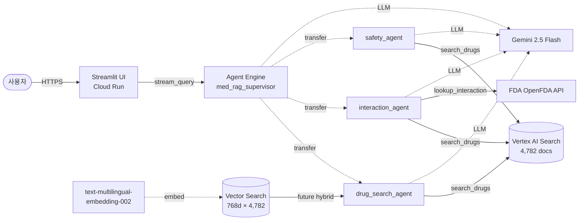
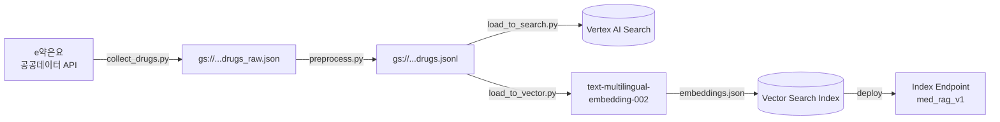
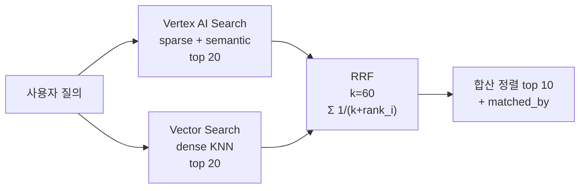

# Vertex MedAgent RAG

원본 [MedAgent-RAG](https://github.com/klsdcv/MedAgent-RAG) (LangGraph + OpenSearch + Chroma + Triton)를 **Google Vertex AI** 스택으로 전면 재작성한 한국어 의약품 상담 RAG.

**라이브 데모:** https://med-rag-ui-719526263781.us-central1.run.app
**데이터:** 공공데이터포털 e약은요 일반의약품 4,782건

---

## 1. 아키텍처



### 데이터 흐름
1. **사용자 질의** → Streamlit UI → Agent Engine `stream_query`
2. **Supervisor LlmAgent** (Gemini 2.5 Flash)가 질의 유형 분류 → `transfer_to_agent`로 sub-agent 위임
3. **Sub-agent**가 도구 호출 (Vertex AI Search / FDA / Vector Search)
4. **Supervisor**가 결과 받아 면책 포함 최종 답변 합성
5. **Streamlit**이 스트리밍 출력

### 인덱싱 파이프라인 (오프라인)


---

## 2. 원본 ↔ Vertex 매핑

| 원본 구성 | Vertex 대체 |
| --- | --- |
| LangGraph `StateGraph` (7노드) | **Google ADK** `LlmAgent` + sub_agents 패턴 (4 agent) |
| OpenSearch (sparse 키워드) | **Vertex AI Search** (Discovery Engine custom data store) |
| Chroma (dense 벡터) | **Vector Search** + `text-multilingual-embedding-002` (768d, COSINE) |
| Triton BGE-M3 임베딩/리랭커 | Vertex 임베딩 API (1차 리랭커 생략) |
| OpenAI GPT-4o | **Gemini 2.5 Flash** (Vertex) |
| Redis 캐시 | 1차 미적용 (Agent Engine session 활용) |
| FastAPI | **Agent Engine** (managed reasoning engine) |
| Streamlit | **Cloud Run** (동일 유지) |
| Triton DUR ONNX | 원본도 외부 FDA API 사용 → 그대로 |

### LangGraph 7-노드 → ADK 4-agent 통합
- 원본 `supervisor` + `answer` → **`med_rag_supervisor` LlmAgent** (분류·라우팅·최종 합성)
- 원본 `drug_search` + `grader` + `crag_rewriter` → **`drug_search_agent`** (모델 자체 판단으로 재검색 루프)
- 원본 `interaction` → **`interaction_agent`** (e약은요 + FDA 양쪽 조회)
- 원본 `safety` → **`safety_agent`**

---

## 3. 기술 스택

| 영역 | 기술 |
| --- | --- |
| 멀티에이전트 프레임워크 | Google ADK (`google-adk` ≥ 0.5) |
| LLM | Gemini 2.5 Flash (Vertex AI) |
| 임베딩 | `text-multilingual-embedding-002` (768d) |
| 키워드+시맨틱 검색 | Vertex AI Search (Discovery Engine) |
| 벡터 검색 | Vertex Vector Search (TreeAH, COSINE) |
| 에이전트 호스팅 | Vertex AI Agent Engine (managed) |
| UI 호스팅 | Cloud Run + Buildpacks |
| 스토리지 | GCS (raw / processed / embeddings) |
| 데이터 소스 | 공공데이터포털 e약은요 |
| 외부 API | OpenFDA Drug API |
| 언어/런타임 | Python 3.11 |
| 빌드 시스템 | hatchling (pyproject.toml) |

---

## 4. 디렉토리 구조

```
Vertex/
├── pyproject.toml
├── Dockerfile                      # Cloud Run Streamlit UI
├── env.example
├── deploy/
│   ├── 00_enable_apis.sh           # 9개 GCP API 활성화
│   ├── 01_create_buckets.sh        # GCS staging + data 버킷
│   ├── 03_build_vector_index.py    # 인덱스 + 엔드포인트 + deploy
│   ├── 04_deploy_agent_engine.py   # ADK 루트 에이전트 배포
│   └── 05_deploy_ui_cloudrun.sh    # Streamlit Cloud Run 배포
├── config/
│   ├── settings.py                 # pydantic-settings (env 자동 로드)
│   └── prompts.py
├── agents/
│   ├── root_agent.py               # supervisor (분류·합성)
│   ├── drug_search_agent.py
│   ├── interaction_agent.py
│   └── safety_agent.py
├── tools/
│   ├── vertex_search.py            # Discovery Engine Search 호출
│   ├── vector_search.py            # 임베딩 → KNN → 메타데이터 결합
│   └── fda_dur.py                  # OpenFDA Drug Event API
├── ingest/
│   ├── collect_drugs.py            # e약은요 → GCS raw
│   ├── preprocess.py               # HTML 제거, JSONL 변환
│   ├── load_to_search.py           # → Vertex AI Search import
│   └── load_to_vector.py           # → 임베딩 → Vector Search 입력
├── ui/
│   └── app.py                      # Streamlit (Agent Engine stream_query)
├── tests/
│   └── test_local_agent.py         # InMemoryRunner 로컬 검증
└── _reference/MedAgent-RAG/        # 원본 참조용 (gitignore)
```

---

## 5. 처음부터 재현하기

```bash
# 0. Python 3.11 + venv
python3.11 -m venv .venv
source .venv/bin/activate
pip install -e ".[dev,ingest]"
cp env.example .env  # 값 채우기 (DATA_API_KEY 필수)

# 1. GCP 사전 준비
gcloud auth application-default login
bash deploy/00_enable_apis.sh
bash deploy/01_create_buckets.sh

# 2. 데이터 인제스천
python -m ingest.collect_drugs        # 4799건 → GCS
python -m ingest.preprocess           # HTML 제거 → JSONL (4782건)
python -m ingest.load_to_search       # Vertex AI Search import
python -m ingest.load_to_vector       # 임베딩 (4분 40초)

# 3. Vector Search 인덱스
python deploy/03_build_vector_index.py   # 30-50분 (deploy 포함)
# → VECTOR_INDEX_ID, VECTOR_INDEX_ENDPOINT_ID 출력. .env에 채움

# 4. IAM (Agent Engine SA에 권한 부여)
for SA in 719526263781-compute@developer.gserviceaccount.com \
          service-719526263781@gcp-sa-aiplatform.iam.gserviceaccount.com \
          service-719526263781@gcp-sa-aiplatform-re.iam.gserviceaccount.com; do
  for R in discoveryengine.viewer aiplatform.user storage.objectViewer; do
    gcloud projects add-iam-policy-binding civic-athlete-500200-t0 \
      --member="serviceAccount:${SA}" --role="roles/${R}" --condition=None
  done
done

# 5. ADK 에이전트 로컬 검증 → Agent Engine 배포
python -m tests.test_local_agent "활명수 효능 알려줘"
python deploy/04_deploy_agent_engine.py
# → AGENT_ENGINE_RESOURCE_NAME 출력. .env에 채움

# 6. Streamlit UI Cloud Run 배포
bash deploy/05_deploy_ui_cloudrun.sh
# → https://med-rag-ui-...run.app 출력
```

---

## 6. 운영 비용 추정

| 리소스 | 단가 | 비고 |
| --- | --- | --- |
| Vector Search 엔드포인트 | ~$0.07/시간 (e2-standard-2) | 살아있는 동안 계속 |
| Agent Engine | invoke당 과금 (Gemini 토큰) | idle 시 0 |
| Cloud Run UI | 요청당 과금 + 최소 인스턴스 0 | 거의 0 |
| Vertex AI Search | 데이터스토어 idle 시 0 | 검색당 미세 과금 |
| GCS | < 100MB | 거의 0 |

데모만 잠깐 쓰면 월 $5 이내, Vector Search 엔드포인트를 계속 켜두면 월 ~$50. 사용 안 할 때 endpoint를 `undeploy_index()`하면 비용 0.

---

## 7. 배운 점 / 트러블슈팅

| 증상 | 원인 | 해결 |
| --- | --- | --- |
| 인덱스 생성 `FAILED_PRECONDITION` | `.jsonl` 확장자 미인식 | 파일명을 `.json`으로 |
| 인덱스 생성 시 restricts 의심 | 한국어 allow 값 (회사명) | restricts 제거 후 성공 (별개 fix) |
| 임베딩 토큰 한도 초과 | 한국어는 1.4 char/token | 동적 배치 (글자수 누적 22000자 기준) |
| Agent Engine 배포 후 컨테이너 fail | `Settings` 필수 필드 missing | `env_vars=` 인자로 GCP/Vertex 환경 주입 |
| Agent Engine `discoveryengine.search` 403 | P4SA에 권한 없음 | 3개 SA × 3개 role 부여 |

---

## 8. 하이브리드 RRF 검색 (Vertex AI Search + Vector Search)



- **공식**: `RRF(d) = Σ_i 1 / (k + rank_i(d))` (Cormack et al. 2009, k=60 표준)
- **장점**: 정규화 불필요 (각 검색기가 다른 점수 분포여도 OK), 한쪽 장애 시 graceful degrade
- **결과 각 항목에 `matched_by`** = `["sparse"|"dense"|both]` — 양쪽 모두 매칭된 게 가장 신뢰

## 9. 세션 영속화

- **Agent Engine 자체가 영속 SessionService 제공** — `create_session()`/`list_sessions()`/`get_session()`로 user_id별 세션 관리, 컨테이너 재시작에도 보존
- **Streamlit user_id 안정화**: URL `?uid=...` query param으로 유지. 새로고침/탭 가로질러 동일 사용자
- **자동 reuse**: 진입 시 `list_sessions(user_id=...)`로 가장 최근 세션 찾아 이어감
- **이력 복원**: `get_session()`의 events에서 user/assistant 메시지 복원해 UI에 그대로 표시
- **새 대화 버튼**: 사이드바에서 명시적 새 세션 생성

> Firestore SessionService 백엔드는 self-host ADK 환경에서 필요. Vertex Agent Engine 위에선 자체 영속 인프라가 우선이라 중복.

## 10. RAGAS 평가 결과

원본의 `data/eval/eval_dataset.json` (20문항: simple 7 / interaction 6 / safety 7)
을 그대로 사용. 평가 LLM은 Vertex Gemini 2.5 Flash, 임베딩은 `text-multilingual-embedding-002`.

### v1 vs v2 비교

| 메트릭 | v1 (drug_search만 hybrid) | v2 (3개 agent 전부 hybrid + timeout 300s) |
| --- | --- | --- |
| faithfulness | nan (timeout) | **0.6388** |
| answer_relevancy | 0.6065 | 0.5810 |
| context_precision | 0.0000 | 0.1667 |
| context_recall | 0.3125 | **0.4000** |

### v2 query_type별

| query_type | faithfulness | answer_relevancy | context_precision | context_recall |
| --- | --- | --- | --- | --- |
| simple (단일 약품) | **0.914** | 0.558 | 0.000 | 0.286 |
| interaction (상호작용) | 0.667 | **0.710** | nan | **0.750** |
| safety (특수 인구) | 0.340 | 0.493 | 0.200 | 0.214 |
| **overall** | 0.639 | 0.581 | 0.167 | 0.400 |

### 인사이트

- **simple 0.914 faithfulness** — 단일 약품 질의에선 검색 컨텍스트에 충실, 할루시네이션 거의 없음
- **interaction 0.75 recall** — hybrid 통일이 두 약품을 함께 검색해 끌어오는 데 명확히 효과
- **safety 낮은 점수** — 평가셋의 ground_truth가 "NSAIDs는 임신 중 금기" 같은 일반 의학지식 위주인데, e약은요는 약품 단위 본문이라 매칭 어려움. **데이터셋 보강 필요**
- **context_precision 낮음 (0.17)** — RRF 후 랭킹이 ground_truth 매칭 기준 정렬과 어긋남. 리랭커(Vertex Ranking API) 추가가 다음 큰 개선 포인트
- **Timeout 일부 잔존** — Gemini Flash 동시 호출 시 ResourceExhausted/timeout. workers 4로 줄였지만 quota 늘리면 추가 개선

산출물: `eval/results/ragas_scores.csv`, `ragas_report.json`, `ragas_report.md`.

## 11. 한계 및 향후 개선

- **CRAG grader + rewriter 루프** 명시화 (ADK `LoopAgent`) — 모델 자체 판단 → 결정론적 그래프로
- **Reranker** (Vertex Ranking API) — 현재 RRF만, cross-encoder 재정렬 미적용
- **응답 캐시** (Memorystore Redis) — 같은 질의 반복 시 비용/지연 절감
- **평가 자동화** (RAGAS / 원본 eval 데이터셋) — 검색·답변 품질 정량화
