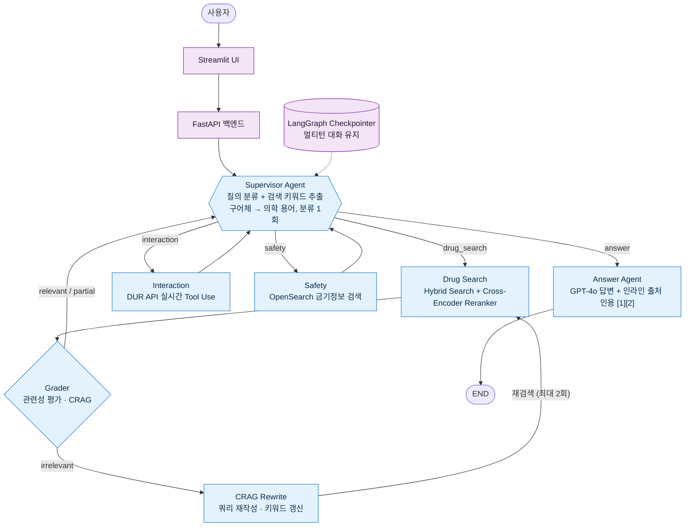

# MedAgent-RAG

LangGraph 기반 Multi-Agent 의약품 QA 시스템

## 개요
사용자가 의약품 관련 질문을 하면, 여러 전문 Agent가 협업하여 답변을 생성하는 Multi-Agent RAG 시스템입니다.

### 예시 질의
- "타이레놀이랑 아스피린 같이 먹어도 돼요?"
- "혈압약 먹고 있는데 두통약 뭐 먹어야 해요?"
- "임산부가 먹을 수 있는 감기약 있어요?"
- "메트포르민 부작용 알려줘"

## 아키텍처



### Agent 상세

| Agent | 역할 | 구현 |
|-------|------|------|
| **Supervisor** | 질의 분류 + LLM 기반 검색 키워드 추출 (구어체 → 의학 용어). 분류는 최초 1회만 수행하고 이후 라우팅 재방문 시 재사용 | LangGraph conditional_edges, JSON 응답 |
| **Drug Search** | 의약품 정보 검색 + 재랭킹 (복합 질의 시 키워드별 분리 검색) | Hybrid Search (Vector + BM25 + RRF) → Cross-Encoder Reranker |
| **Grader** | 검색 결과 관련성 평가 (Corrective RAG) | GPT-4o (relevant/partial/irrelevant 판정) |
| **CRAG Rewrite** | Grader가 irrelevant 판정 시 쿼리 재작성 → 검색 키워드 갱신 후 재검색 (최대 2회) | GPT-4o |
| **Interaction** | 약물 상호작용 확인 | DUR 병용금기 API 실시간 호출 (LangChain Tool Use) |
| **Safety** | 복용 주의사항 확인 (임부금기, 연령대금기) | OpenSearch safety 인덱스 BM25 검색 |
| **Answer** | 최종 답변 합성 + 인라인 출처 인용 [1][2] + 이전 대화 맥락 반영 | GPT-4o |

### 질의 유형별 라우팅

| 질의 유형 | 호출 경로 | 예시 |
|-----------|----------|------|
| 단순 약 정보 | Supervisor → Drug Search → Grader → Answer | "타이레놀 효능 알려줘" |
| 약물 상호작용 | Supervisor → Drug Search → Grader → Interaction → Answer | "타이레놀이랑 아스피린 같이 먹어도 돼?" |
| 복용 주의 | Supervisor → Drug Search → Grader → Safety → Answer | "임산부가 먹을 수 있는 감기약?" |
| 복합 질의 | Supervisor → Drug Search → Grader → Interaction → Safety → Answer | "혈압약 먹고 있는데 두통약 추천해줘" |

> Grader가 `irrelevant`로 판정하면 **CRAG Rewrite → Drug Search**로 되돌아가 재검색하는 보정 루프가 추가된다 (최대 2회).

## 기술 스택

| 영역 | 기술 |
|------|------|
| Agent 오케스트레이션 | LangGraph, LangChain |
| LLM | OpenAI GPT-4o |
| 임베딩 | BGE-M3 (ONNX + Triton Inference Server, GPU) |
| 재랭킹 | BGE-Reranker-v2-M3 (Cross-Encoder) |
| 검색 | Hybrid Search (ChromaDB Vector + OpenSearch BM25 + RRF) |
| 벡터 DB | ChromaDB |
| 키워드 검색 | OpenSearch 2.18 (nori 한국어 형태소 분석기) |
| 대화 관리 | LangGraph MemorySaver (멀티턴 Checkpointing) |
| 평가 | RAGAS (faithfulness, answer_relevancy, context_precision, context_recall) |
| 데이터 | 공공데이터포털 식약처 API (e약은요, DUR) |
| API 서버 | FastAPI + Uvicorn (SSE 스트리밍) |
| UI | Streamlit (FastAPI SSE 연동) |
| 배포 | Docker Compose (FastAPI + Streamlit + Triton + OpenSearch) |

## 검색 파이프라인

### Hybrid Search + Cross-Encoder Rerank

```
[사용자 질의] → [Supervisor LLM] → 질의 분류 + 검색 키워드 추출 (구어체 → 의학 용어 변환)
                                    예: "관절약이랑 소화제" → ["관절 글루코사민", "소화제 소화효소"]
      │
      ├──▶ [BGE-M3 임베딩] → ChromaDB 벡터 검색 (의미 유사도) ──┐
      │       (키워드별 분리 검색)                                ▼
      ├──▶ [OpenSearch] → nori 형태소 분석 → BM25 검색 ──▶ [RRF 통합 (top 10)]
      │                                                          │
      └──────────────────────────────────────────────────▶ [BGE-Reranker Cross-Encoder]
                                                                 │
                                                           최종 top 5 반환
```

- **벡터 검색**: "두통약 추천" → 해열진통제 계열 의약품 매칭 (의미 기반)
- **OpenSearch BM25**: "타이레놀" → 정확한 약물명 매칭 (nori 형태소 분석)
- **RRF**: 두 결과를 가중 합산 (vector 60% + BM25 40%)
- **Cross-Encoder Reranker**: (query, document) 쌍을 직접 평가하여 최종 순위 결정

### 임베딩 서빙

- **모델**: BAAI/bge-m3 (1024차원, 다국어)
- **서빙**: ONNX 변환 → Triton Inference Server (GPU, RTX 3050 8GB 테스트 완료)
- **변환**: `scripts/convert_bge_m3_onnx.py`
- **성능**: 문장당 ~150ms (GPU)

### 리랭커 서빙

- **모델**: BAAI/bge-reranker-v2-m3 (Cross-Encoder)
- **서빙**: ONNX 변환 → Triton (`bge_reranker`), 실패 시 CPU CrossEncoder fallback
- **변환**: `scripts/convert_reranker_onnx.py` (dynamic batch 보존을 위해 batch≥2 더미로 export)
- **튜닝**: 토큰 길이 `max_length=256` (RTX 3050에서 512 대비 리랭킹 지연 대폭 단축, 의약품 문서 관련성에 영향 미미)

## 데이터

| 데이터 | 출처 | 건수 | 용도 |
|--------|------|------|------|
| 의약품개요정보 (e약은요) | 식약처 공공데이터포털 | 4,697건 | Drug Search (효능, 용법, 성분) |
| DUR 특정연령대금기 | 식약처 DUR | 2,666건 | Safety Agent |
| DUR 임부금기 | 식약처 DUR | 16,276건 | Safety Agent |
| DUR 병용금기 | 식약처 DUR API | 실시간 호출 | Interaction Agent (Tool Use) |

## 프로젝트 구조

```
MedAgent-RAG/
├── src/
│   ├── agents/              # Agent 노드 구현
│   │   ├── supervisor.py    # 질의 분류 + 라우팅 (분류 1회 후 재사용)
│   │   ├── query_rewriter.py # CRAG 재작성 (검색 실패 시 키워드 갱신·재검색)
│   │   ├── drug_search.py   # 하이브리드 검색 + Reranker
│   │   ├── grader.py        # 검색 결과 관련성 평가 (CRAG)
│   │   ├── interaction.py   # DUR API 약물 상호작용 확인
│   │   ├── safety.py        # 임부금기/연령대금기 검색
│   │   └── answer.py        # 최종 답변 생성 (멀티턴 맥락 포함)
│   ├── graph/
│   │   ├── state.py         # MedAgentState 타입 정의
│   │   └── workflow.py      # LangGraph StateGraph + MemorySaver + 스트리밍
│   ├── data/                # 데이터 수집 및 전처리
│   │   ├── collect_drugs.py
│   │   ├── collect_dur.py
│   │   ├── preprocess_drugs.py
│   │   ├── preprocess_dur.py
│   │   ├── load_to_chroma.py
│   │   └── load_to_opensearch.py
│   ├── vectorstore/
│   │   ├── triton_embedder.py    # Triton HTTP 임베딩 클라이언트
│   │   ├── reranker.py           # BGE Cross-Encoder Reranker
│   │   └── opensearch_client.py  # OpenSearch BM25 검색 클라이언트
│   ├── evaluation/
│   │   └── evaluator.py          # RAGAS 평가 파이프라인 (예측 체크포인트 저장)
│   ├── tools/
│   │   └── dur_api.py       # DUR 병용금기 API (LangChain Tool)
│   ├── api/                 # FastAPI 백엔드
│   │   ├── main.py          # FastAPI 앱 (CORS, health check)
│   │   ├── schemas.py       # Pydantic 요청/응답 모델
│   │   └── routes/
│   │       └── query.py     # 질의/스트리밍/세션 엔드포인트
│   ├── ui/
│   │   └── app.py           # Streamlit UI (FastAPI SSE 연동)
│   └── config/
│       ├── settings.py
│       └── prompts.py
├── scripts/
│   ├── convert_bge_m3_onnx.py
│   ├── convert_reranker_onnx.py     # BGE-Reranker ONNX 변환 (dynamic batch)
│   ├── run_eval.py                  # RAGAS 평가 실행 (전체 시스템)
│   └── run_baseline_eval.py         # 단순 RAG 베이스라인 평가 + A/B 비교
├── data/
│   └── eval/eval_dataset.json    # 평가 데이터셋
├── triton_models/
│   ├── bge_m3/config.pbtxt
│   └── bge_reranker/config.pbtxt
├── docker/
│   ├── docker-compose.yml
│   ├── Dockerfile.api       # FastAPI 서비스
│   ├── Dockerfile.ui        # Streamlit 서비스
│   └── opensearch.Dockerfile
├── requirements.txt
└── .gitignore
```

## 설치 및 실행

### 1. 환경 설정

```bash
python3.11 -m venv .venv
source .venv/bin/activate
pip install -r requirements.txt

cp .env.example .env
# .env에 OPENAI_API_KEY, DATA_API_KEY 입력
```

### 2. 인프라 (Triton + OpenSearch)

```bash
# BGE-M3 → ONNX 변환
python scripts/convert_bge_m3_onnx.py

# Triton + OpenSearch 실행
docker compose -f docker/docker-compose.yml up -d
```

### 3. 데이터 수집 및 적재

```bash
python -m src.data.collect_drugs
python -m src.data.preprocess_drugs
python -m src.data.load_to_chroma
python -m src.data.load_to_opensearch

python -m src.data.collect_dur
python -m src.data.preprocess_dur
```

### 4. 실행

```bash
# FastAPI 백엔드
uvicorn src.api.main:app --host 0.0.0.0 --port 8080

# Streamlit UI (별도 터미널)
API_BASE_URL=http://localhost:8080 streamlit run src/ui/app.py
```

API 문서: `http://localhost:8080/docs`

### 5. 평가

```bash
# 전체 평가 (멀티에이전트 시스템)
python scripts/run_eval.py --save

# 특정 유형만
python scripts/run_eval.py --type simple

# 단순 RAG 베이스라인 평가 + 전체 시스템과 A/B 비교 (개선폭 % 출력)
python scripts/run_baseline_eval.py --save
```

> RAGAS judge LLM은 `src/evaluation/evaluator.py`의 `_RAGAS_LLM`에서 지정한다(기본 `gpt-4o`).
> 절대 점수는 judge 모델에 민감하므로, 베이스라인과 시스템을 **동일 judge**로 측정해 상대 개선폭으로 비교하는 것을 권장한다.
