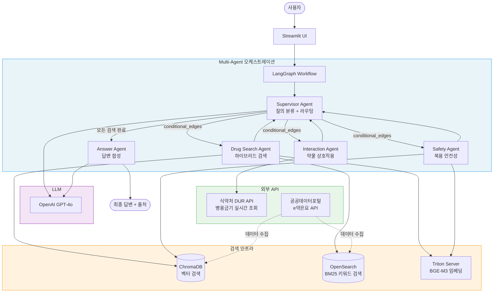
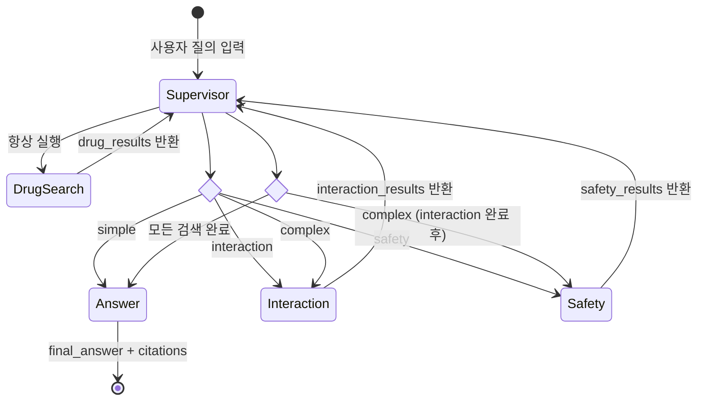
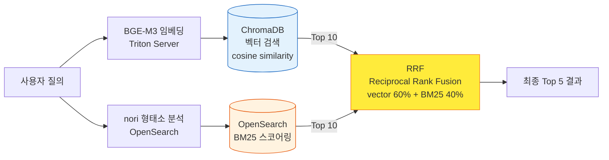
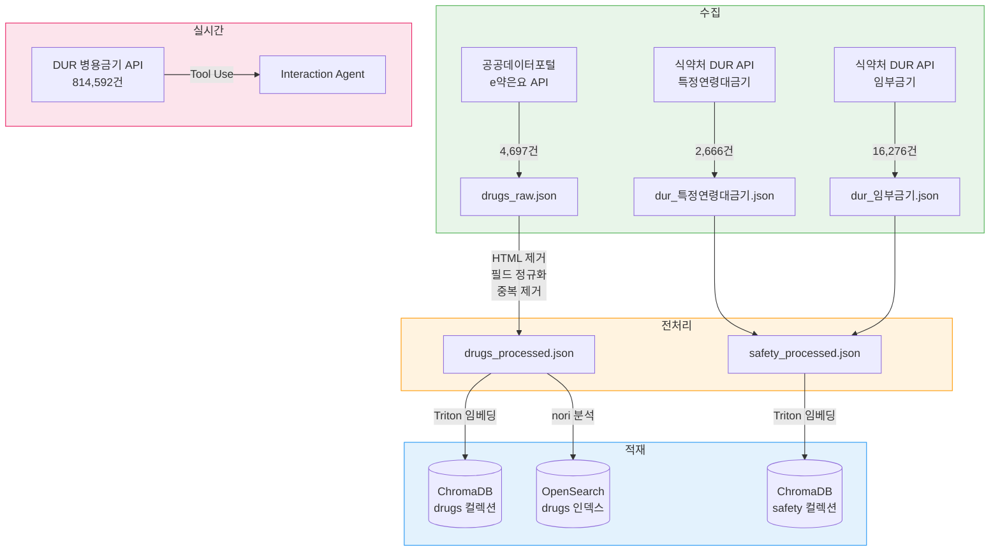
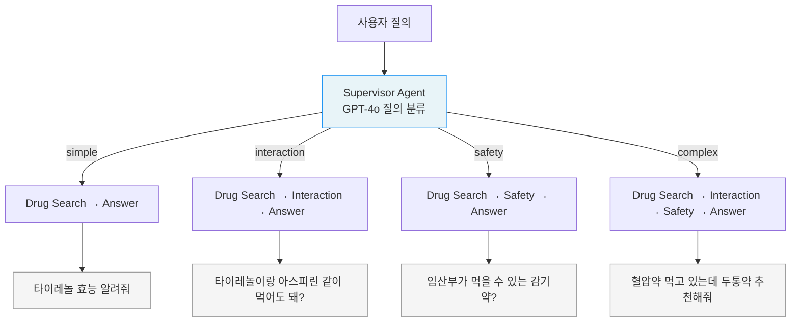
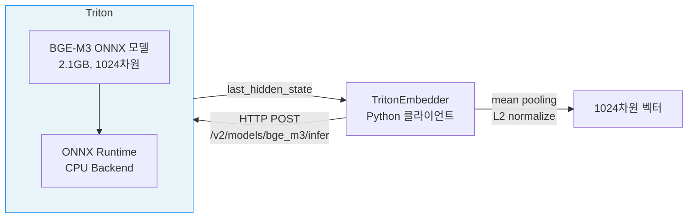
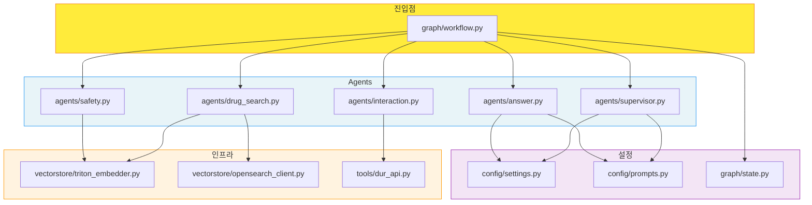

# MedAgent-RAG 아키텍처 다이어그램

## 1. 시스템 전체 아키텍처

```mermaid
graph TB
    User([사용자]) --> UI[Streamlit UI]
    UI --> Workflow[LangGraph Workflow]

    subgraph Agents["Multi-Agent 오케스트레이션"]
        Workflow --> Supervisor[Supervisor Agent<br/>질의 분류 + 라우팅]
        Supervisor -->|conditional_edges| DrugSearch[Drug Search Agent<br/>하이브리드 검색]
        Supervisor -->|conditional_edges| Interaction[Interaction Agent<br/>약물 상호작용]
        Supervisor -->|conditional_edges| Safety[Safety Agent<br/>복용 안전성]
        DrugSearch --> Supervisor
        Interaction --> Supervisor
        Safety --> Supervisor
        Supervisor -->|모든 검색 완료| Answer[Answer Agent<br/>답변 합성]
    end

    subgraph LLM["LLM"]
        GPT4o[OpenAI GPT-4o]
    end

    subgraph Search["검색 인프라"]
        ChromaDB[(ChromaDB<br/>벡터 검색)]
        OpenSearch[(OpenSearch<br/>BM25 키워드 검색)]
        Triton[Triton Server<br/>BGE-M3 임베딩]
    end

    subgraph ExternalAPI["외부 API"]
        DUR[식약처 DUR API<br/>병용금기 실시간 조회]
        DataPortal[공공데이터포털<br/>e약은요 API]
    end

    Supervisor --> GPT4o
    Answer --> GPT4o
    DrugSearch --> ChromaDB
    DrugSearch --> OpenSearch
    DrugSearch --> Triton
    Safety --> ChromaDB
    Safety --> Triton
    Interaction --> DUR
    DataPortal -.->|데이터 수집| ChromaDB
    DataPortal -.->|데이터 수집| OpenSearch

    Answer --> Response([최종 답변 + 출처])

    style Agents fill:#e8f4f8,stroke:#2196F3
    style Search fill:#fff3e0,stroke:#FF9800
    style LLM fill:#f3e5f5,stroke:#9C27B0
    style ExternalAPI fill:#e8f5e9,stroke:#4CAF50
```

## 2. LangGraph 워크플로 흐름도

```mermaid
stateDiagram-v2
    [*] --> Supervisor: 사용자 질의 입력

    Supervisor --> DrugSearch: 항상 실행
    DrugSearch --> Supervisor: drug_results 반환

    state 질의유형분기 <<choice>>
    Supervisor --> 질의유형분기

    질의유형분기 --> Answer: simple
    질의유형분기 --> Interaction: interaction
    질의유형분기 --> Safety: safety
    질의유형분기 --> Interaction: complex

    Interaction --> Supervisor: interaction_results 반환
    Safety --> Supervisor: safety_results 반환

    state complex분기 <<choice>>
    Supervisor --> complex분기
    complex분기 --> Safety: complex (interaction 완료 후)
    complex분기 --> Answer: 모든 검색 완료

    Answer --> [*]: final_answer + citations
```

## 3. 하이브리드 검색 파이프라인

```mermaid
graph LR
    Query[사용자 질의] --> Embed[BGE-M3 임베딩<br/>Triton Server]
    Query --> Nori[nori 형태소 분석<br/>OpenSearch]

    Embed --> ChromaDB[(ChromaDB<br/>벡터 검색<br/>cosine similarity)]
    Nori --> OS[(OpenSearch<br/>BM25 스코어링)]

    ChromaDB --> |Top 10| RRF[RRF<br/>Reciprocal Rank Fusion<br/>vector 60% + BM25 40%]
    OS --> |Top 10| RRF

    RRF --> Result[최종 Top 5 결과]

    style RRF fill:#ffeb3b,stroke:#f57f17
    style ChromaDB fill:#e3f2fd,stroke:#1565c0
    style OS fill:#fff3e0,stroke:#e65100
```

## 4. 데이터 수집·적재 파이프라인

```mermaid
graph TD
    subgraph 수집
        API1[공공데이터포털<br/>e약은요 API] -->|4,697건| Raw1[drugs_raw.json]
        API2[식약처 DUR API<br/>특정연령대금기] -->|2,666건| Raw2[dur_특정연령대금기.json]
        API3[식약처 DUR API<br/>임부금기] -->|16,276건| Raw3[dur_임부금기.json]
    end

    subgraph 전처리
        Raw1 -->|HTML 제거<br/>필드 정규화<br/>중복 제거| Proc1[drugs_processed.json]
        Raw2 --> Proc2[safety_processed.json]
        Raw3 --> Proc2
    end

    subgraph 적재
        Proc1 -->|Triton 임베딩| ChromaDB[(ChromaDB<br/>drugs 컬렉션)]
        Proc1 -->|nori 분석| OpenSearch[(OpenSearch<br/>drugs 인덱스)]
        Proc2 -->|Triton 임베딩| ChromaSafety[(ChromaDB<br/>safety 컬렉션)]
    end

    subgraph 실시간
        DUR[DUR 병용금기 API<br/>814,592건] -->|Tool Use| Interaction[Interaction Agent]
    end

    style 수집 fill:#e8f5e9,stroke:#4CAF50
    style 전처리 fill:#fff3e0,stroke:#FF9800
    style 적재 fill:#e3f2fd,stroke:#2196F3
    style 실시간 fill:#fce4ec,stroke:#e91e63
```

## 5. 질의 유형별 Agent 라우팅

```mermaid
graph TD
    Q[사용자 질의] --> S[Supervisor Agent<br/>GPT-4o 질의 분류]

    S -->|simple| F1["Drug Search → Answer"]
    S -->|interaction| F2["Drug Search → Interaction → Answer"]
    S -->|safety| F3["Drug Search → Safety → Answer"]
    S -->|complex| F4["Drug Search → Interaction → Safety → Answer"]

    F1 --> Ex1["타이레놀 효능 알려줘"]
    F2 --> Ex2["타이레놀이랑 아스피린 같이 먹어도 돼?"]
    F3 --> Ex3["임산부가 먹을 수 있는 감기약?"]
    F4 --> Ex4["혈압약 먹고 있는데 두통약 추천해줘"]

    style S fill:#e8f4f8,stroke:#2196F3
    style Ex1 fill:#f5f5f5,stroke:#9e9e9e
    style Ex2 fill:#f5f5f5,stroke:#9e9e9e
    style Ex3 fill:#f5f5f5,stroke:#9e9e9e
    style Ex4 fill:#f5f5f5,stroke:#9e9e9e
```

## 6. 임베딩 서빙 아키텍처

```mermaid
graph LR
    Client[TritonEmbedder<br/>Python 클라이언트] -->|HTTP POST<br/>/v2/models/bge_m3/infer| Triton[Triton Inference Server<br/>Docker Container]

    subgraph Triton
        ONNX[BGE-M3 ONNX 모델<br/>2.1GB, 1024차원]
        ORT[ONNX Runtime<br/>CPU Backend]
        ONNX --> ORT
    end

    Triton -->|last_hidden_state| Client
    Client -->|mean pooling<br/>L2 normalize| Embedding[1024차원 벡터]

    style Triton fill:#e8f4f8,stroke:#2196F3
```

## 7. 모듈 의존성

```mermaid
graph TD
    subgraph 진입점
        Workflow[graph/workflow.py]
    end

    subgraph Agents
        Supervisor[agents/supervisor.py]
        DrugSearch[agents/drug_search.py]
        Interaction[agents/interaction.py]
        Safety[agents/safety.py]
        Answer[agents/answer.py]
    end

    subgraph 인프라
        Triton[vectorstore/triton_embedder.py]
        OS[vectorstore/opensearch_client.py]
        DUR[tools/dur_api.py]
    end

    subgraph 설정
        Settings[config/settings.py]
        Prompts[config/prompts.py]
        State[graph/state.py]
    end

    Workflow --> Supervisor
    Workflow --> DrugSearch
    Workflow --> Interaction
    Workflow --> Safety
    Workflow --> Answer
    Workflow --> State

    Supervisor --> Settings
    Supervisor --> Prompts
    DrugSearch --> Triton
    DrugSearch --> OS
    Interaction --> DUR
    Safety --> Triton
    Answer --> Settings
    Answer --> Prompts

    style 진입점 fill:#ffeb3b,stroke:#f57f17
    style Agents fill:#e8f4f8,stroke:#2196F3
    style 인프라 fill:#fff3e0,stroke:#FF9800
    style 설정 fill:#f3e5f5,stroke:#9C27B0
```
